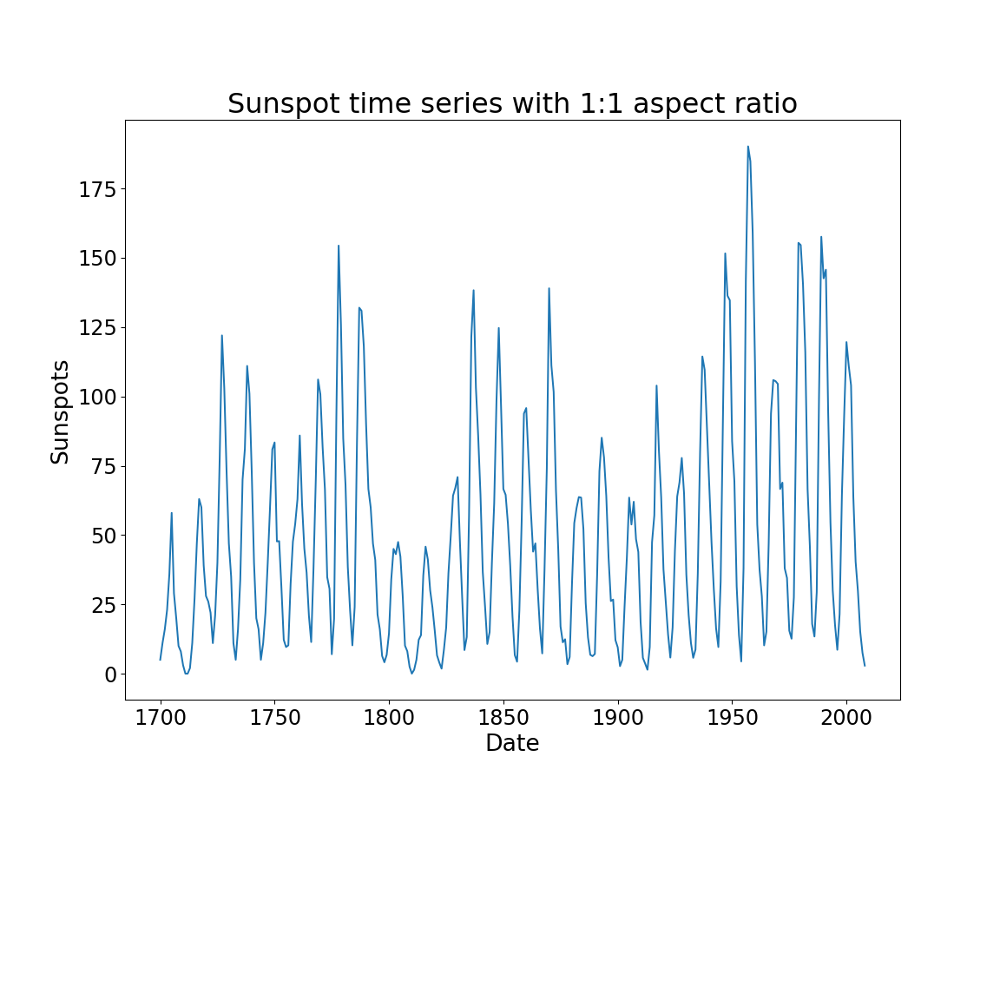

# Python code

In RStudio modify the keyboard shortcuts to automatically insert a Python new chunk.

Tools >> Modify Keyboard Shortcuts... >> Find Chunk... Click in the middle cell end enter your favorite keyboard sequence.

I used _Ctrl-Alt-p_ (i.e., lower case p)

# Libraries


```python
print('hello, world')
```

```
## hello, world
```
# Load data sunspots from statsmodels


```python
sunspots_data = sm.datasets.sunspots.load_pandas().data
sunspots_data.head()
```

```
##      YEAR  SUNACTIVITY
## 0  1700.0          5.0
## 1  1701.0         11.0
## 2  1702.0         16.0
## 3  1703.0         23.0
## 4  1704.0         36.0
```

# Print a time series


```python
fig, ax = plt.subplots(figsize=(12, 12))
fig.subplots_adjust(bottom=0.3)
ax = sns.lineplot(x='YEAR', y='SUNACTIVITY', data=sunspots_data, ci=None, ax=ax)
_=ax.set_title('Sunspot time series with 1:1 aspect ratio', fontsize=24)
_=ax.set_xlabel('Date', fontsize=20)
_=ax.set_ylabel('Sunspots', fontsize=20)
_=ax.tick_params(labelsize=18)
plt.show()
```




# Print a time series, different proportions


```python
fig, ax = plt.subplots(figsize=(20, 1))
fig.subplots_adjust(bottom=0.4,top=0.7)
ax = sns.lineplot(x='YEAR', y='SUNACTIVITY', data=sunspots_data, ci=None, ax=ax)
_=ax.set_title('Sunspot time series with 20:1 aspect ratio', fontsize=24)
_=ax.set_xlabel('Date', fontsize=20)
_=ax.set_ylabel('Sunspots', fontsize=20)
_=ax.tick_params(labelsize=18)
plt.show()
```


